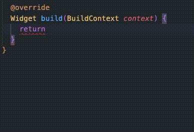
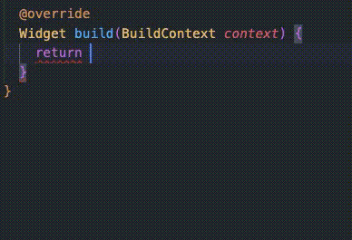

# Parentheses Newline - VSCode Extension


## Description

Parentheses Newline is a Visual Studio Code extension that allows you to have the `Accept Suggestions On Enter` feature enabled, while still being able to create new lines when the cursor is inside empty parentheses.

This is particularly useful when coding in Dart/Flutter, as it provides the flexibility to place the closing parenthesis of a new widget on a new line instead of automatically autocompleting the first suggestion in the suggestion list.

## Features

- Allows enabling the `Accept Suggestions On Enter` in VSCode while also allowing you to create newlines when the cursor is inside empty parentheses.
- Clicking `enter` inside empty parantheses will create a new line, even when there is a suggestion visible.
- Clicking `enter` if you have typed anything and there is a suggestion will instead accept the selected suggestion.
- Makes coding in `Dart/Flutter` smoother, as you can easily move the end parenthesis of a newly created widget to a new line without accidentally autocompleting the topmost suggestion.

## Installation

1. Launch Visual Studio Code.
2. Go to the Extensions view (Ctrl/Cmd+Shift+X) or click on the square icon on the left sidebar.
3. Search for "Parentheses Newline" in the extensions search bar.
4. Click on the "Install" button for the Parentheses Newline extension.
5. After the installation is complete, the extension will be activated automatically.

## Usage

To use the Parentheses Newline extension, you need to add the following code to your `keybindings.json` file:

```json
{
    "key": "enter",
    "command": "parentheses-newline.insertNewlineOrAcceptSuggestion",
    "when": "editorTextFocus && suggestWidgetVisible"
}
```
## Demo
### Before/After
 

## Release Notes
### 0.0.1
- Initial release of Parentheses Newline.

## License
This extension is licensed under the [MIT License](LICENSE).


